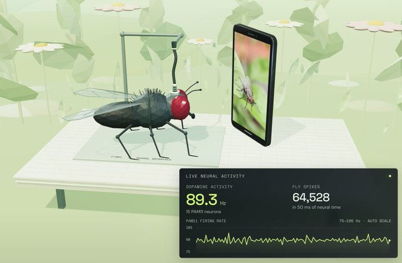

# Fly / Wirehead on Kaggle 📱

<p align="center"></p>

Run the full **[fly-wirehead](https://github.com/mattyhempstead/fly-wirehead)** fruit fly connectome simulation entirely in the cloud via **Kaggle** and interact with the 3D Three.js environment directly from your browser using **Pinggy SSH Tunnel**.

---

## 📌 Overview

The original `fly-wirehead` simulates a fruit fly connectome (166,700 neurons, 25.6M synaptic connections) watching a continuous loop of insect YouTube Shorts. Running it locally requires ~16 GB RAM, a C++17 compiler, and multiple local tools.

This repository provides a self-contained Jupyter Notebook (`.ipynb`) that:
* Sets up the C++ environment and Python dependencies automatically in Kaggle.
* Downloads the **MaleCNS v1.0** dataset (~1.1 GB) and prepares the portrait video feed.
* Automatically patches local-origin and WebSocket session locks using Python AST rewriting so the app can be exposed remotely.
* Injects a custom on-screen Control Dock into the HTML for easy touch/mouse interaction.
* Tunnels port `4173` via **Pinggy** to give you a public, temporary `https://*.pinggy.net` URL to view the 3D visualizer and live dopamine telemetry.

---

## 🚀 Quick Start (Running on Kaggle)

1. **Create a Kaggle Notebook**:
   * Go to [Kaggle](https://www.kaggle.com/) and create a new notebook.
   * Upload `fly_wirehead_kaggle_final.ipynb` (or import via URL).
2. **Configure Notebook Settings**:
   * Under the **Notebook Settings** panel on the right:
     * **Internet**: `On` *(Required to fetch datasets, videos, and compiler tools)*
     * **Accelerator**: `CPU` (or `GPU T4` — standard CPU tier has sufficient RAM).
3. **Run the Cells**:
   * **Cell 1–3**: Environment setup, C++ symlinking, connectome prep, and shortform video download.
   * **Cell 4**: Applies AST security bypasses to allow remote origins, injects the on-screen UI controls, and starts the simulation alongside the Pinggy SSH tunnel.
4. **Open the App**:
   * Click the printed `https://*.pinggy.net` link in the Cell 4 output.
   * Enjoy the 3D observation chamber and live neural telemetry.

---

## 🎮 Interactive Controls
*NOTICE : THE UI AND KEYPRESSES ARE BUGGY AND CAN BREAK DOWN RANDOMLY .* 

Once the Three.js observation chamber loads in your browser, you can use your physical keyboard or the **on-screen Control Dock** at the bottom of the screen:

| Key / Input | Action |
| :--- | :--- |
| **Mouse Drag** | Orbit and rotate the observation camera |
| **Scroll / ArrowDown / Next Button** | Force swipe to the next Short |
| **Space / Pause Button** | Pause / resume video playback and neural input |
| **P / Dopamine Button** | Deliver a 200 ms artificial current pulse to the 15 PAM11 dopamine cells |
| **C / Camera Button** | Switch camera perspective |
| **F / Fullscreen Button** | Toggle fullscreen |
| **M** | Toggle video audio |
| **S / Save Button** | Save a brain checkpoint |

---

## 🛠️ How It Works

1. **AST Security Patching**:
   The native upstream server validates that requests only come from strict local sessions (`localhost` / local origin checks). When tunneled, these reject remote connections. The notebook parses the server code using Python's `ast` module, strips session/origin gates, and unparses back to disk prior to launch.
2. **UI Injection**:
   Before launching the server, the script searches for the compiled HTML files and injects a custom, touch-friendly HUD (Control Dock) to trigger keyboard events natively from the browser window.
3. **Zero-Configuration Tunneling**:
   Instead of requiring account tokens (like default `ngrok` setups) or installing additional binaries (like `cloudflared`), it natively uses SSH to create an ephemeral public tunnel via Pinggy instantly without authentication.
4. **Native Kernel Compilation**:
   The notebook detects the Kaggle environment's `g++` toolchain and configures the environment to compile the spiking neural kernel on first launch.

---

## 🛑 Stopping the Simulation

Run **Section 6** in the notebook to terminate running background processes:

```python
stop(server_proc, "server_proc")
stop(tunnel_proc, "tunnel_proc")
```
## Credits & Acknowledgments
Original project and connectome engine: mattyhempstead/fly-wirehead

Upstream spiking neural backend inspiration: nftechie/stonkfly

Neural wiring data: MaleCNS v1.0 dataset (CC BY 4.0).

3D Rendering: Three.js.
